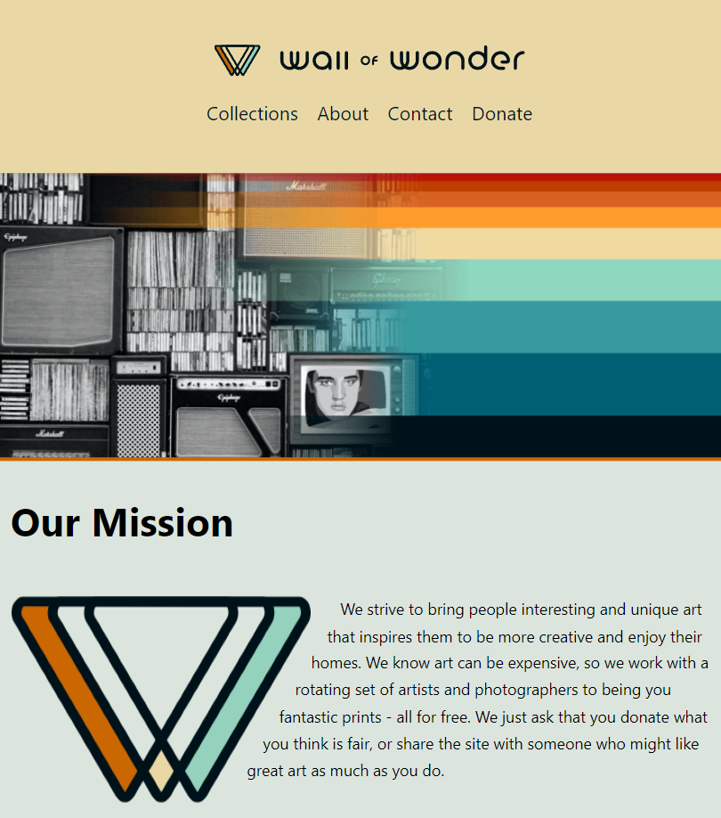

### Hi there 👋

I'm Rafael, a junior web developer who loves to create and learn new things. After trying different careers, 
I discovered that web development was the perfect fit for me. It lets me use both my tech skills and my 
creativity to build amazing websites and apps.I recently got my level 5 diploma in web development from 
Code Institute, and I'm currently learning more with Frontend Masters and self-study.

  

#### Languages and Tools

<code></code>
<code></code>
<code></code>
<code></code>
<code></code>
<code></code>
<code></code>
<code></code>
<code></code>
<code></code>
<code></code>
<code></code>
<code></code>
<code></code>
<code></code>

##### Learning in progress...
<code></code>
<code></code>
<code></code>
 ████████████████████▒░░░░ 

##### Learning goals
<code></code>
<code></code>
<code></code>
<code></code>
<code></code>
<code></code>

  
<b>Some projects and exercises</b>

   

#### Let's connect!

    

##### Web3
 

